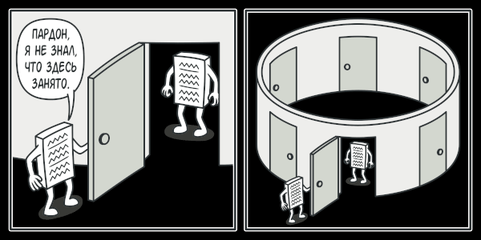

# Одиночка (Singleton)
**Одиночка** — это порождающий паттерн проектирования, который гарантирует, что у класса есть только один экземпляр, и предоставляет к нему глобальную точку доступа.

## Проблема
Одиночка решает сразу две проблемы, нарушая принцип единственной ответственности класса.

1. **Гарантирует наличие единственного экземпляра класса.** Чаще всего это полезно для доступа к какому-то общему ресурсу, например, базе данных.
Представьте, что вы создали объект, а через некоторое время пробуете создать ещё один. В этом случае хотелось бы получить старый объект, вместо создания нового.
2. **Предоставляет глобальную точку доступа.** Это не просто глобальная переменная, через которую можно достучаться к определённому объекту. Глобальные переменные не защищены от записи, поэтому любой код может подменять их значения без вашего ведома.

## Решение
Скрыть конструктор по умолчанию и создать публичный статический метод, который и будет контролировать жизненный цикл объекта-одиночки.