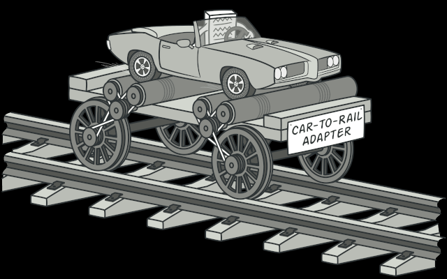
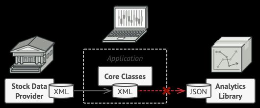
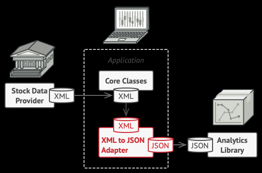

# Адаптер (Adapter)
**Также известен как:** Wrapper, Обёртка

**Адаптер** — это структурный паттерн проектирования, который позволяет объектам с несовместимыми интерфейсами работать вместе.

## Проблема

Предствим, что приложение скачивает данные в виде XML и рисуети графики.
Затем, решили сменить библиотеку для графиков, но она использует JSON.

## Решение
Вы можете создать адаптер. Это объект-переводчик, который трансформирует интерфейс или данные одного объекта в такой вид, чтобы он стал понятен другому объекту.

